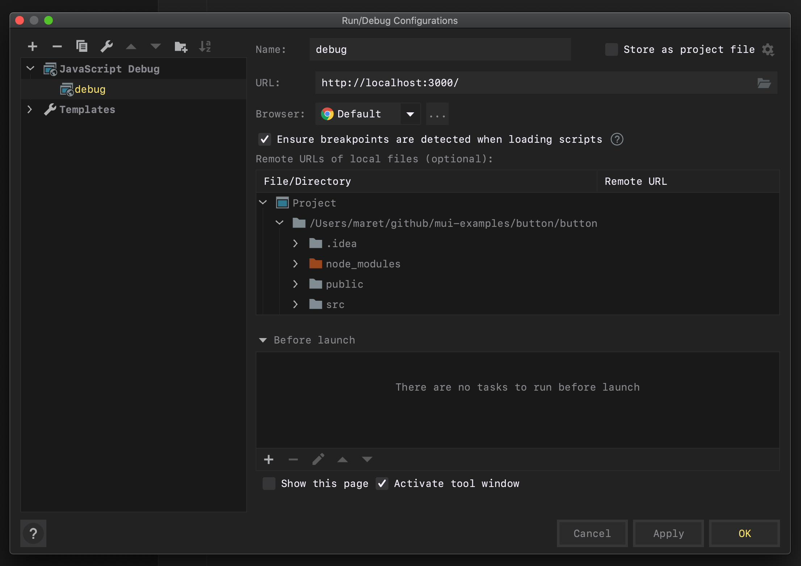

<!-- START doctoc generated TOC please keep comment here to allow auto update -->
<!-- DON'T EDIT THIS SECTION, INSTEAD RE-RUN doctoc TO UPDATE -->

- [Design](#design)
- [Info](#info)
- [Debug using WebStorm](#debug-using-webstorm)
  - [Configure debugger](#configure-debugger)
  - [Run the debugger:](#run-the-debugger)
- [How to style button component](#how-to-style-button-component)
- [How to configure Prettier](#how-to-configure-prettier)
- [Git error - Fatal: remote origin already exists](#git-error---fatal-remote-origin-already-exists)
- [Change master to main (2020-06-27)](#change-master-to-main-2020-06-27)

<!-- END doctoc generated TOC please keep comment here to allow auto update -->

# Design


# Info

- Using React and Material UI library to style a button with Higher Order
  Component.
- I am also changing **ripple color** to darker red!!!

# Debug using WebStorm

## Configure debugger

1. Click `Add Configuration...` on the toolbar
2. Select JavaScript
3. Configure the debugger:

- 

## Run the debugger:

1. Add break point to the line I don't understand something.
2. Click debug **icon** on the toolbar.
3. Step over to the next line.
4. Use expression evaluator (calculator icon) to find out the value of the thing
   that was confusing.

# How to style button component

Button uses TouchRipple class to create ripple animation effects. Look at the
CSS section (Rule name) in the API docs to find the rule you want to override.

If you can't find anything suitable in this CSS section, please refer to the
source code for TouchRipple.js.

- [API docs](https://v4-3-3.material-ui.com/api/touch-ripple/#css)
- [TouchRipple.js](https://github.com/mui-org/material-ui/blob/master/packages/material-ui/src/ButtonBase/TouchRipple.js)

# How to configure Prettier

1. Make a `.prettierrc` file in the project root folder with the following:

```json
{
  "printWidth": 80,
  "proseWrap": "always"
}
```

2. Make a `watcher.xml` file in the project root folder with the following:

```xml
<TaskOptions>
  <TaskOptions>
    <option name="arguments" value="$FilePath$" />
    <option name="checkSyntaxErrors" value="true" />
    <option name="description" />
    <option name="exitCodeBehavior" value="ERROR" />
    <option name="fileExtension" value="md" />
    <option name="immediateSync" value="false" />
    <option name="name" value="md-doctoc" />
    <option name="output" value="" />
    <option name="outputFilters">
      <array />
    </option>
    <option name="outputFromStdout" value="false" />
    <option name="program" value="/usr/local/bin/doctoc" />
    <option name="runOnExternalChanges" value="false" />
    <option name="scopeName" value="All Places" />
    <option name="trackOnlyRoot" value="true" />
    <option name="workingDir" value="" />
    <envs />
  </TaskOptions>
  <TaskOptions>
    <option name="arguments" value="--write $FilePath$" />
    <option name="checkSyntaxErrors" value="true" />
    <option name="description" />
    <option name="exitCodeBehavior" value="ERROR" />
    <option name="fileExtension" value="md" />
    <option name="immediateSync" value="false" />
    <option name="name" value="md-prettier" />
    <option name="output" value="" />
    <option name="outputFilters">
      <array />
    </option>
    <option name="outputFromStdout" value="false" />
    <option name="program" value="/usr/local/bin/prettier" />
    <option name="runOnExternalChanges" value="false" />
    <option name="scopeName" value="All Places" />
    <option name="trackOnlyRoot" value="true" />
    <option name="workingDir" value="" />
    <envs />
  </TaskOptions>
</TaskOptions>
```

3. Open File watchers in preferences in IDEA and `Import` the `watcher.xml`.
4. Save edits on the markdown file, and it will be reformatted.

# Git error - Fatal: remote origin already exists

- [Article to fix the problem](https://www.datree.io/resources/git-error-fatal-remote-origin-already-exists)

# Change master to main

The
[Internet Engineering Task Force (IETF) points out](https://tools.ietf.org/id/draft-knodel-terminology-00.html#rfc.section.1.1.1)
that "Master-slave is an oppressive metaphor that will and should never become
fully detached from history" as well as "In addition to being inappropriate and
arcane, the
[master-slave metaphor](https://github.com/bitkeeper-scm/bitkeeper/blob/master/doc/HOWTO.ask?WT.mc_id=-blog-scottha#L231-L232)
is both technically and historically inaccurate." There's lots of more accurate
options depending on context and it costs me nothing to change my vocabulary,
especially if it is one less little speed bump to getting a new person excited
about tech.

You might say, "I'm all for not using master in master-slave technical
relationships, but this is clearly an instance of master-copy, not master-slave"
[but that may not be the case](https://mail.gnome.org/archives/desktop-devel-list/2019-May/msg00066.html).
Turns out the original usage of master in Git very likely came from another
version control system (BitKeeper) that explicitly had a notion of slave
branches.

- https://dev.to/lukeocodes/change-git-s-default-branch-from-master-19le
- https://www.hanselman.com/blog/EasilyRenameYourGitDefaultBranchFromMasterToMain.aspx

[#blacklivesmatter](https://blacklivesmatter.com/)
