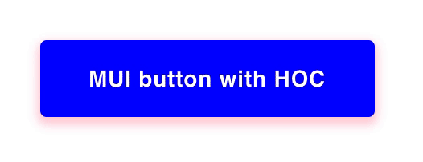

# Design

# Info
- Using React and Material UI library to style a button with Higher Order
 Component.
- I am also changing **ripple color** to darker red!!!

# Debug using WebStorm

## Configure debugger
1. Click `Add Configuration...` on the toolbar
2. Select JavaScript
3. Configure the debugger:
  - 
  
## Run the debugger:
1. Add break point to the line I don't understand something.
2. Click debug **icon** on the toolbar.
3. Step over to the next line.
4. Use expression evaluator (calculator icon) to find out the value of the
 thing that was confusing.